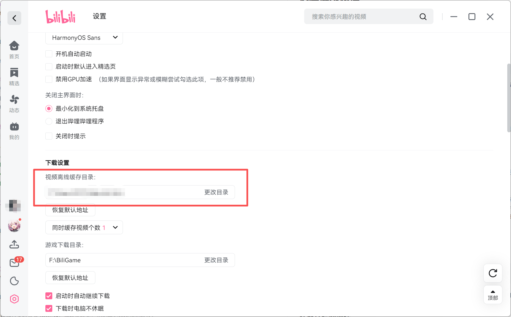
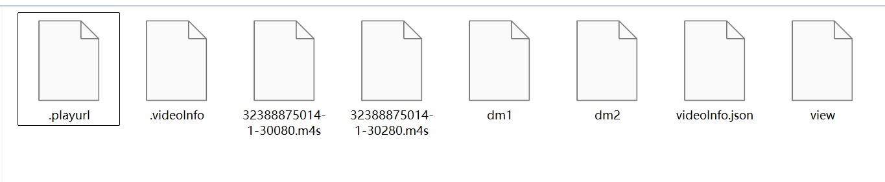
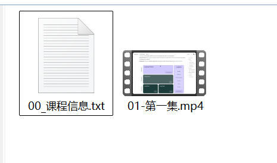

# B站离线缓存视频转 MP4 格式工具
## 简介
在哔哩哔哩客户端**批量下载整门课程、合集、系列教程**后，本地缓存为特殊格式文件，无法直接在播放器、手机、平板等设备播放；而市面上多数工具仅支持通过视频链接**单个下载**，无法适配客户端已下载的批量课程缓存。

本工具专为解决该痛点设计，是**哔哩哔哩客户端离线缓存批量转 MP4 工具**：无需重新下载视频，直接读取客户端已缓存的课程文件，全自动批量转换为通用 MP4 格式，支持多门课程自动分类整理，转换后的视频可随意转存至任意设备播放。

工具核心特点：
1.  自动识别B站离线缓存，按视频BV号归类课程，同一门课程的所有分集自动放进同一个文件夹；
2.  每个课程文件夹自动生成 `00_课程信息.txt`，留存课程信息，默认排在文件夹首位，方便查找；
3.  转换后的视频文件名，完全沿用B站原生分集名称，干净无冗余前缀；
4.  不改动B站原始缓存文件，转换全程操作临时文件，缓存可正常在B站客户端播放，不影响原有使用；
5.  自动备份原始缓存文件，转换完成后自动清理临时垃圾文件，不占用额外空间；
6.  批量转换速度快，支持多线程并发，已转换的视频可跳过，避免重复操作；
7.  配套还原清理脚本，一键恢复缓存目录原始状态，删除所有备份和临时文件。

## 目录结构说明
```
项目根目录
├── .env.example          环境配置模板
├── .gitignore           Git忽略配置
├── bilibili_converter.py  主转换程序
├── bilibili_restore.py    缓存还原清理程序
└── converted/           MP4输出目录
```

## 快速使用教程
### 一、环境准备（全平台通用）
1.  安装 Python 3.9 及以上版本（电脑已安装可跳过）
2.  安装项目依赖库，打开终端执行命令：
```bash
pip install python-dotenv
```
3.  **安装 FFmpeg 工具（必需）**
    - 官方下载地址：https://ffmpeg.org/download.html
    - 下载对应系统的压缩包，解压后**配置系统环境变量**（配置完成后重启终端生效）

---

### 二、获取 B 站缓存目录（关键步骤）
1.  打开哔哩哔哩客户端，进入「我的」→「设置」
2.  找到「视频离线缓存目录」，查看并复制该文件夹路径
3.  此路径即为工具所需的 **B站缓存目录**

<center>
<div>
  
  <h5>
    图 1 B 站缓存目录
  </h5>
</div>
</center>

---

### 三、配置项目文件
1.  复制项目根目录的 `.env.example`，并重命名为 `.env`
2.  打开 `.env` 文件，配置以下核心参数：
    - `BILIBILI_CACHE_DIR`：粘贴复制的 B 站缓存目录路径
    - `OUTPUT_MP4_DIR`：自定义 MP4 视频输出路径（如 `D:\B站课程转换`）
    - `MAX_WORKERS`：并发转换线程数（默认 3，高配电脑可设 5-8）
    - `SKIP_EXISTING`：是否跳过已转换视频（默认 True，节省时间）

---

### 四、执行批量转换
打开终端，进入项目根目录，执行转换命令：
```bash
python bilibili_converter.py
```

程序将自动完成：识别缓存 → 按课程分类 → 批量转换 → 输出 MP4

B站客户端下载的每个视频会对应生成一个文件夹，文件夹内包含缓存文件、配置信息等特殊格式文件，无法直接在通用播放器播放；本工具会自动解析该目录结构，将其转换为单个标准 MP4 视频文件。

如某一个视频离线缓存后，转换前文件目录结构如 **图 2** 所示。
<center>
<div>
  
  <h5>
    图 2 视频格式转换前目录
  </h5>
</div>
</center>

转换后目录结构如 **图 3** 所示。

<center>
<div>
  
  <h5>
    图 3 视频格式转换后目录
  </h5>
</div>
</center>

程序支持批量转换，操作步骤同上。

---

### 五、缓存还原清理
如需清理缓存目录的备份/临时文件，恢复 B 站客户端视频缓存目录原始状态，执行：
```bash
python bilibili_restore.py
```

---

### 各系统操作补充
#### Windows 系统
1.  环境变量配置：将 FFmpeg 解压后的 `bin` 文件夹路径添加到系统 `Path`
2.  终端推荐使用 CMD 或 PowerShell，以管理员身份运行更佳

#### Mac 系统
1.  推荐使用 Homebrew 安装 FFmpeg：`brew install ffmpeg`
2.  终端直接执行命令，无需额外权限

#### Linux 系统
1.  APT 安装：`sudo apt install ffmpeg`
2.  YUM 安装：`sudo yum install ffmpeg`

## 输出文件结构示例
```
converted/（你配置的输出目录）
├─ BV1ZppNzHEY4/（按BV号命名的课程文件夹）
│  ├─ 00_课程信息.txt（课程名称说明，排在首位）
│  ├─ 01-课程介绍.mp4（B站原生分集名称）
└─ BVxxxxxxx/（另一门课程的文件夹）
   ├─ 00_课程信息.txt
   └─ 各分集视频.mp4
```

## 使用注意事项
1.  仅支持哔哩哔哩客户端**原生离线缓存**，不支持网页端、第三方工具下载的视频
2.  请勿移动、重命名 B 站缓存文件夹及内部文件，否则会导致转换失败
3.  必须正确安装并配置 FFmpeg 环境变量，否则无法完成视频合并
4.  转换过程中请勿手动删除缓存内临时文件，程序会自动清理
5.  若意外中断转换，可运行还原脚本清理残留文件，再重新转换

## 版权与侵权声明
1.  本工具**仅用于个人学习、本地离线缓存格式转换**，仅限个人本地自用，禁止用于商用、二次分发、倒卖、公开传播等行为；
2.  所有视频版权归原作者、哔哩哔哩平台所有，本工具仅提供本地格式转换功能，不涉及任何资源破解、盗链、侵权分发行为；
3.  若您使用本工具产生版权纠纷、公开传播、商用牟利等违规行为，一切责任由使用者自行承担，本项目作者不承担任何连带责任；
4.  如使用场景涉嫌侵权，请立即停止使用本工具，并删除所有转换后的视频文件及本项目代码；
5.  请严格遵守网络版权相关法律法规，请勿将转换后的视频上传至其他平台、分享至网盘、售卖课程等。

## 许可
本项目仅开源代码逻辑，仅供技术学习与个人离线自用，请自觉遵守版权规则，合理合规使用。